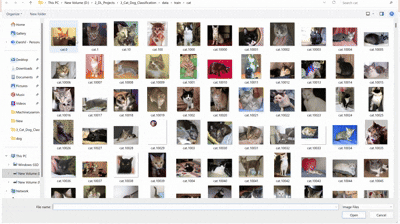

## 🐾 End-to-End Pet Classifier: MLOps & Full-Stack API

### 📌 Project Overview

This project is a production-grade image classification system that identifies cats and dogs using Transfer Learning (MobileNetV2). It features a complete MLOps pipeline, automated testing gates, and a modern FastAPI web interface with a persistent history dashboard.

---

### 🛠️ Tech Stack
1. **Deep Learning:** TensorFlow 2.15+, Keras 3 (Native .keras format)
2. **Inference API:** FastAPI, Uvicorn, Jinja2 Templates 
3. **Front-End:** Tailwind CSS, JavaScript (LocalStorage)
4. **Data Pipeline:** tf.data API with Parallel Pre-fetching 
5. **Quality Assurance:** Pytest (Multi-stage validation gates)
6. **DevOps:** Docker, GitHub Actions (optional), Hugging Face Spaces

---

### 🏗️ Pipeline Architecture

The project follows a **Gated Execution Flow** to ensure reliability and performance:

1. **Infrastructure Validation:** Automated checks for environment variables and model architecture.
2. **Automated Ingestion:** Secure dataset retrieval via Kaggle API and programmatic directory organization.
3. **Data Integrity Check:** Post-download verification of image assets and pipeline compatibility.
4. **Optimized Training:** Transfer Learning with MobileNetV2 utilizing a high-throughput `tf.data` input pipeline.
5. **Artifact Generation:** Model persistence using the Native Keras (`.keras`) format.

---

### Demo

--- 

### 🚀 Core Features & Optimizations

* **Memory Management:** Implements `.cache()` and `.prefetch(AUTOTUNE)` to minimize I/O overhead and maximize GPU utilization.
* **Adaptive Learning:** Utilizes `ReduceLROnPlateau` to dynamically adjust the learning rate during training for finer convergence.
* **Modular Design:** Complete separation of concerns between configuration, source logic, and utility functions.
* **Custom Observability:** Detailed logging including epoch-level execution timers and training metadata.

---
3. Full-Stack ML Dashboard
The FastAPI backend is paired with a modern UI that includes:
- **Drag-and-Drop Ingestion:** Effortless image uploading. 
- **Client-Side History:** A persistent sidebar using Browser LocalStorage to track recent predictions without requiring a database. 
- **Asynchronous Inference:** Utilizing aiofiles for non-blocking file handling.

---

### 📂 Project Structure

```text
├── api/              # FastAPI application & Jinja2 templates
├── configs/          # Centralized hyperparameters & relative paths
├── models/           # Persistent storage for .keras artifacts
├── src/              # Core logic: Ingestion, Building, Training, Prediction
├── tests/            # Pytest suite (Infrastructure, Data, Model)
├── utils/            # Performance monitors & Logging
├── main.py           # Pipeline Orchestrator
└── Dockerfile        # Containerization for cloud deployment
```

---

### 🚦 Getting Started

#### **1. Environment Setup**

Create a `.env` file in the root directory to store your credentials:

```text
KAGGLE_USERNAME=your_kaggle_username
KAGGLE_API_TOKEN=your_kaggle_api_token
```

#### **2. Installation**

```bash
# Install dependencies
pip install -r requirements.txt

# Execute the pipeline (Train/Test)
python main.py

# Start the Web UI
uvicorn api.main:app --reload
```
Navigate to http://127.0.0.1:8000 to access the dashboard.

---

### 📊 Observability

The system generates logs to track performance metrics in real-time. This includes total training duration and epoch-specific timings to verify data-caching efficiency.

---

### 🧪 Testing

Unit tests are written using `pytest`. To run the test suite independently:

```bash
pytest tests/
```

### 📦 Deployment
This project is containerized using Docker. The Dockerfile is optimized for cloud environments like Hugging Face Spaces or AWS App Runner, utilizing a lightweight Python-slim image.
